# Enterprise-Network-Troubleshooting-Lab-CCNA-Level-
Designed and Implemented a mult-router enterprise network in Cisco Packet Tracer, incorporating VLAN segmentation, inter-VLAN routing, OSPF, DHCP, ACLs and NAT. Simulated real-world network failures and performed structured troubleshooting to restore connectivity across internal networks and external internet access.

# Network Topology
Description:

-  R1: Router-on-a-stick (VLAN 10 and VLAN 20)
-  R2: Core routing (OSPF transit)
-  R3: Edge router (Server network + NAT + ISP)

-  VLAN 10: 192.168.10.0/24 (PC1)
-  VLAN 20: 192.168.20.0/24 (PC2)
-  VLAN 30: 192.168.20.0/24 (PC3)

-  R1 ⇔ R2: 10.0.12.0/24
-  R2 ⇔ R3: 10.0.23.0/24
-  R3 ⇔ ISP: 200.0.0.0/30
-  ISP ⇔ Public Server: 8.8.8.0/24

Network Topology:
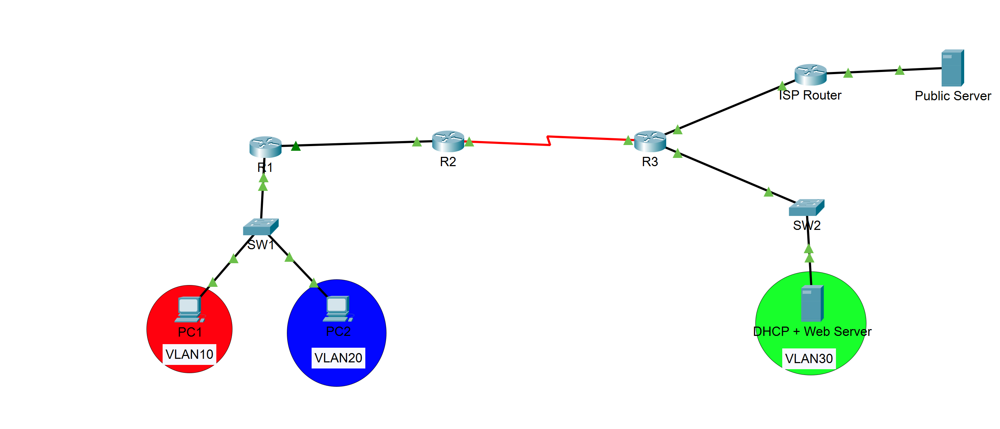

# Technologies Used
-  VLANs(802.1Q)
-  Inter-VLAN Routing (Router-on-a-Stick)
-  DHCP (with helper address)
-  OSPF (Dynamic Routing)
-  ACLs (Access Control Lists)
-  NAT Overload (PAT)
-  Static & Default Routing

# Troubleshooting Scenarios

## Issue #1 - DHCP Failure

### Problem: 
PC1 is unable to receive an IP address from the DHCP server, but PC2 is able to receive a DHCP IP address.

#### [PC1 w/ DHCP request failure]
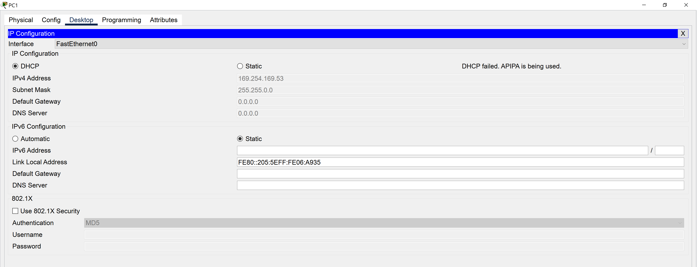

### Investigation: 

-  Ping R1 subinterface to see if there is connectivity from PC1 and PC2
	- PC1 fails, but PC2 works
	- Set static IP address for PC1 (192.168.10.50 255.255.255.0) and a manual default-gateway (192.168.10.1)
	- PC1 ping to R1 subinterface (192.168.10.1) now successful
- Test connectivity with ping cmd between R3 and server(192.168.30.10)
	- Ping test shows connectivity successful
- Test connectivity with ping cmd between R3 and PC1 (192.168.10.50)
	- Ping test shows connectivity successful
- Connectivity is there, but PC1 is still unable to get DHCP IP address
- DHCP requests are broadcast so they need a relay to reach a DHCP server on another subnet
- Check to see if ip helper-address is connected to see subinterface on R1
	- use cmd "sh running-config" to display info about running-configuration
	- see that there is an ip helper-address for the g0/0.20 subinterface, but none for the 
	g0/0.10 subinterface

### Root Cause: 

The root cause of this issue was that the g0/0.10 subinterface didn't have the ip helper-address
so that the DHCP request from PC1 could be forwarded to the DHCP server

### Fix:

Issue cmd "ip helper-address 192.168.30.10" to the g0/0.10 subinterface on R1

### Verification: 

#### (Running Config)
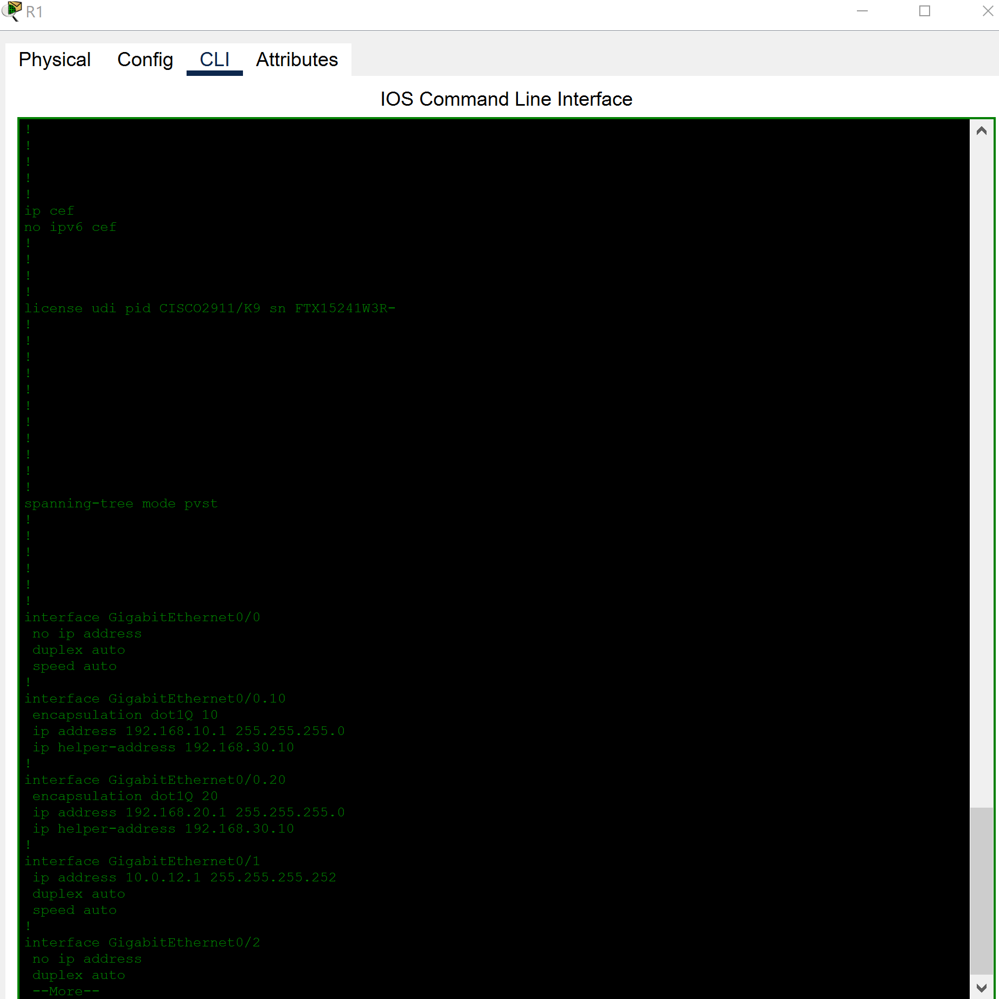

#### (PC1 DHCP Request Successful)
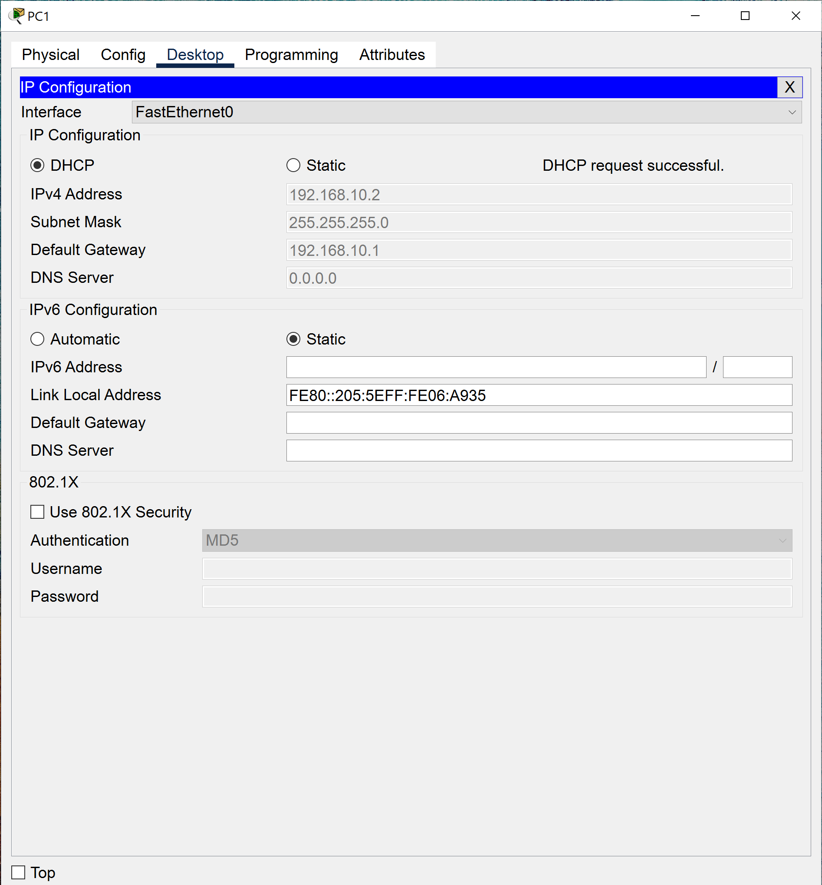

## Isue #2 - OSPF Routing Failure

### Problem: 

PC1 and PC2 are unable to connect to the server and R3 while R2 has no route to vlan 30 (doesn't advertise its networks but still has
learned routes from neighbors)

#### (Screenshot of PC1 ping failure)
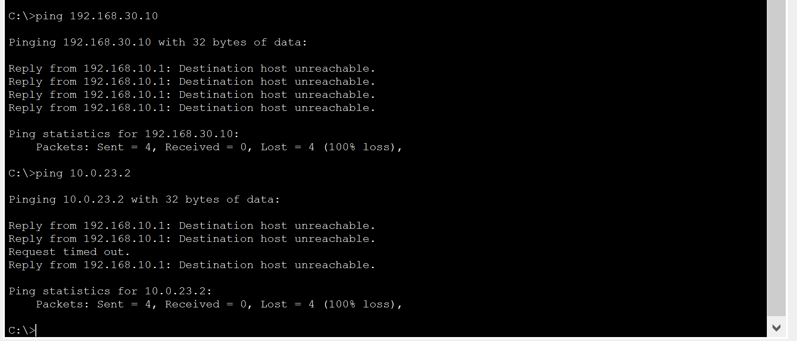

#### (Screenshot of R2 not advertising any networks)
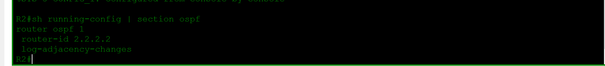

### Investigation:

- Issue the "sh ip ospf neighbor" cmd on R1, R2 and R3
	- All 3 return blank so we know it is an issue with the routing
- Issue the cmd "sh running-config | section ospf" to determine if each router is advertising their networks
	-R1 is advertising its network except to vlan 20, R3 is advertising its networks and R2 is not advertising any networks
- Put R2 in router-config mode and have it advertise the networks attached to its s0/3/0 and g0/0 interfaces
	- check to see if network is advertised with "sh running-config | section ospf"
	- It is and now check "sh ip route" to make sure routes are advertised
	- Now ping 192.168.30.10(server) (success) and 192.168.20.2 (PC2) (failure)
-Issue the cmd "sh running-config | section ospf" on R1 and see that the vlan 20 network is not being advertised
	- advertise the network from R1
	- cmd "sh running-config | section ospf" and see that the vlan 20 network is being advertised
	-Go back to R2 and ping 192.168.20.2 (PC2)(success)

### Root Cause: 

Root causes were because R2 was not advertising any of its networks and R1 was not advertising its vlan 20 network.

### Fix:

On R2: 
- R2(config)#router ospf 1
- R2(config-router)#network 10.0.12.0 0.0.0.255 area 0 
- R2(config-router)#network 10.0.23.0 0.0.0.255 area 0
- R2(config-router)#end

On R1:
- R2(config)#router ospf 1
- R2(config-router)#network 192.168.20.0 0.0.0.255 area 0
- R2(config-router)#end

### Verification: 

#### (Screenshot of R2 ping success to server and PC2)
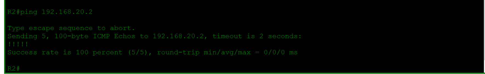

#### (Screenshot of routing tables for R1 and R2)
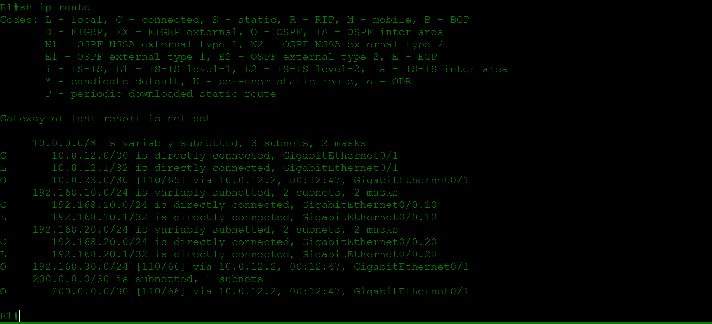
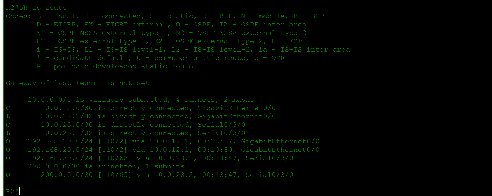

## Issue #3 - ACL Blocking Traffic

### Problem: 

PC1 is unable to access the Web Server, but PC2 is able to access the server

#### (Screenshot of PC1 ping failure)

#### (Screenshot of PC2 ping failure)

### Investigation:
- Check the connectivity using the ping cmd on R1, R2 and R3 to web server(192.168.30.10)
	- Each is successfully able to reach the web server
- Check the connectivity using the ping cmd from PC1 to R1(192.168.10.1) and PC2(192.168.20.2)
	- Connections were successful
- Know it can't be an issue with having a route to the server from R1 since PC2 was able to
connect to the server
- Issue the cmd "sh access-list" on R1 to see if any ACLs have been configured
	- Two rules for extended access-list 101: deny ip traffic from vlan 10 to vlan 30 and 
	permit ip traffic from anywhere else to anywhere
	-Issue the cmd "sh running-config | section interface" to see where the access list is applied
		- Applied on interface g0/1 in the outbound direction (towards R2)

### Root Cause: 

ACL applied with parameters that blocked traffic from vlan 10 (PC1) to vlan 30 (web server)

### Fix:

Remove the ACL since there is no need for us to block traffic from vlan 10 or 20 to vlan 30

On R1:
	-R1(config)#no access-list 101
	-R1(config)#end

### Verification: 

#### (PC1 ping to web server)
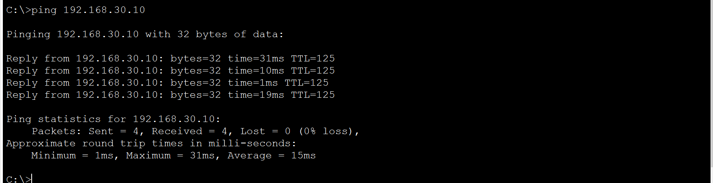

#### (R1 blank access-list)
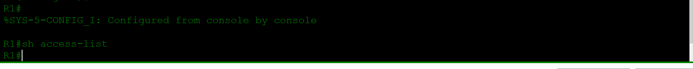

## Issue #4 - NAT/Internet Access Failure

### Problem: 

Only R3 is able to reach the public server(8.8.8.8) while all other devices can't

#### (R1 unable to ping)

#### (PC1 unable to ping)

#### (R3 able to ping)

### Investigation:

- Since we are trying to reach the outside network, we can assume that it is a NAT issue so we start
on R3 we check whether NAT has been configured correctly and whether an acl has been configured
	- issue the cmd "sh access-list" and we see that we have a standard access-list that 
	permits ip addresses in the 192.168.0.0 0.0.255.255 range
	-issue cmd "sh running-config | section nat" and we see that we have configured 1 outside nat interface(g0/0)
	and two nat inside interfaces(s0/3/0 and g0/1) and issued a nat overload gateway on int g0/0
	-These are all correctly placed based off the topology
- Ping R3 from PC1 and we see that the ping was successful so we know that the connectivity is there between networks
- Issue the "sh ip route" on R1 and R2
	-Now we see the issue: on both routers there were no default routes to unknown ip addresses, only a route to the ISP
	router (200.0.0.0/30) through recursive routes on each
	-Without a default route, PC1 wouldn't be able to get to the public server because it hasn't learned how to get there
- Go to R3 and issue the cmd "sh ip route" 
	-Results show that a default-gateway had been configured on R3 to the network 0.0.0.0 through 200.0.0.2(int on ISP)
	-Solve this by putting R3 into global config mode and then issue cmd "router ospf 1" 
	-Then issue the cmd "default-information originate" so that all other ospf routers would send all unknown traffic to R3
- Go back to R1 and R2 and issue the cmd "sh ip route" and you'll see each has default-routes now
- Go to PC1 and ping 8.8.8.8 and now it is successful
- On R3, issue the cmd "sh ip nat translations" and now we have a full table showing that PC1 is actually interacting with the 
NAT gateway.
	
### Root Cause: 

The root cause was from both R1 and R2 not having a default-gateway set for unknown traffic.

### Fix:

The fix was issuing the "default-information originate" cmd on R3 so that R1 and R2 would have default-routes

### Verification: 

#### (R3 ip nat table)

#### (R1 routing table)
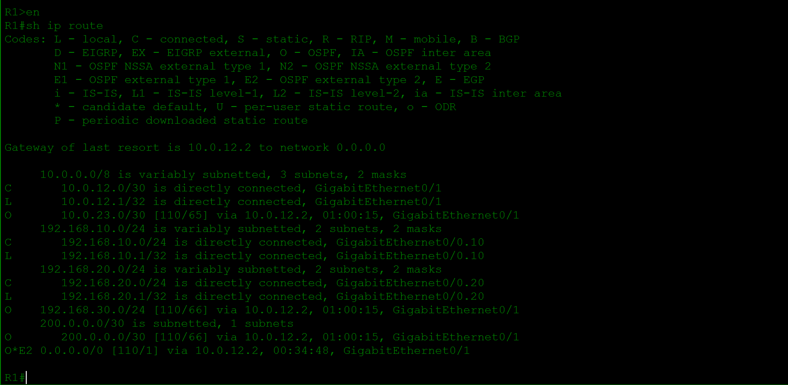

#### (PC1 ping successful to public server (8.8.8.8))
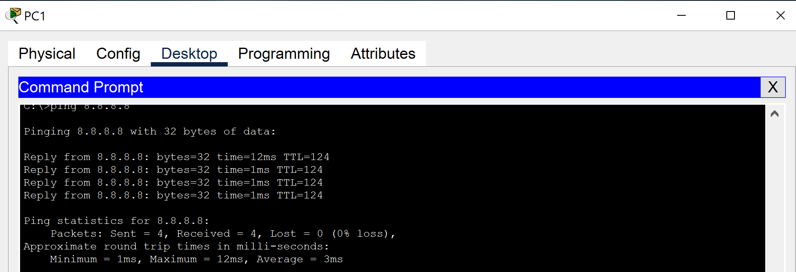

# Verification Commands
